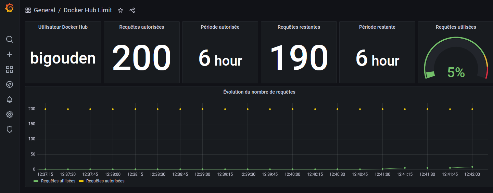

# Docker Hub Limit Exporter

## Description

Exporter Prometheus des statistiques de récupération d'images sur Docker Hub.

## Variable d'environement

| Variable d'environement | Description | Valeur par défaut |
| ------ | ------ | ------ |
| DOCKERHUB_LIMIT_EXPORTER_LOGLEVEL | Niveau de verbosité de l'exporter | INFO |
| DOCKERHUB_LIMIT_EXPORTER_NAME | Valeur 'job' des métriques remontées | dockerhub-limit-exporter |
| DOCKERHUB_LIMIT__EXPORTER_PORT | Port d'écoute de l'exporter | 8123 |
| HTTP_PROXY | Proxy HTTP  | Vide |
| HTTPS_PROXY | Proxy HTTPS  | Vide |

## Format des métriques

Les métriques remontées par l'exporter sont toutes préfixées par la chaine de caractère : **'dockerhub_'**.


```bash
# HELP dockerhub_ratelimit_limit total number of pulls that can be performed within a six hour window
# TYPE dockerhub_ratelimit_limit gauge
dockerhub_ratelimit_limit{dockerhub_username="bigouden",job="dockerhub-limit-exporter",ratelimit_limit_interval="21600",ratelimit_remaining_interval="21600"} 200.0
# HELP dockerhub_ratelimit_remaining number of pulls remaining for the six hour rolling window
# TYPE dockerhub_ratelimit_remaining gauge
dockerhub_ratelimit_remaining{dockerhub_username="bigouden",job="dockerhub-limit-exporter",ratelimit_limit_interval="21600",ratelimit_remaining_interval="21600"} 189.0
```

## Lancement de l'exporter

L'exporter est "packagé" sous forme de conteneur Docker. 

Une fois le conteneur construit, il peut être lancé comme suit :

`docker run -dit -p 8123:8123 dockerhub-limit-exporter`

## Tableau de bord Grafana

Un tableau de bord Grafana est disponible dans le répertoire **grafana** et permet l'exploitation des métriques remontées par l'exporter.

_Capture d'écran :_


